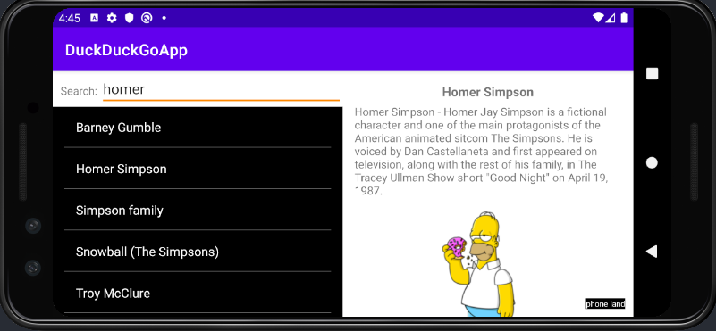
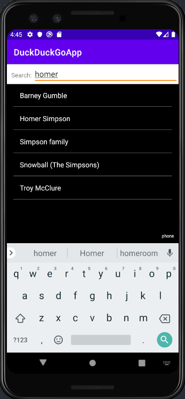
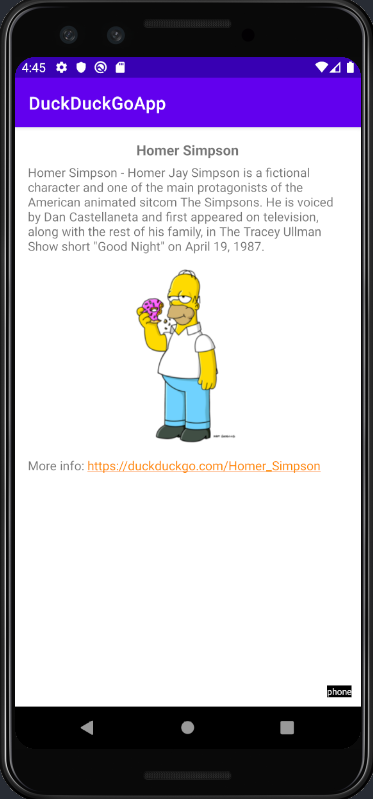
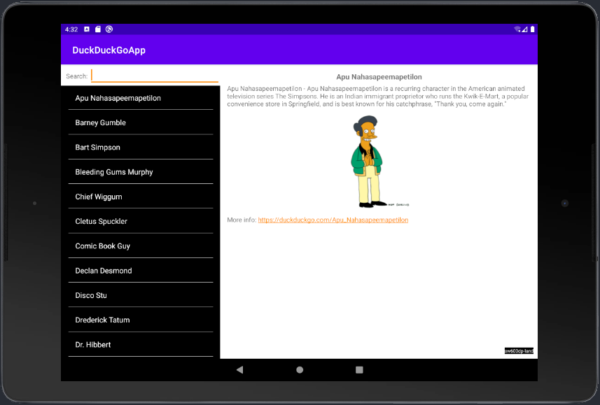
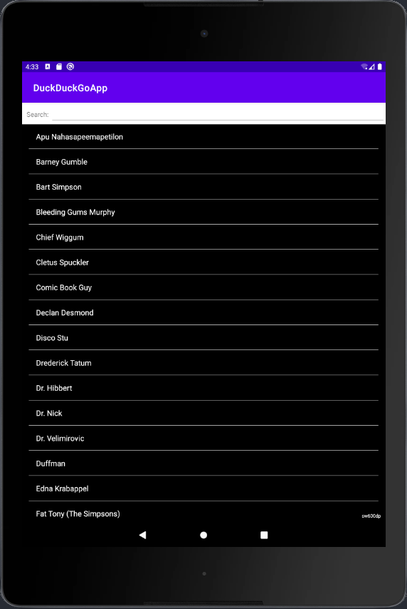
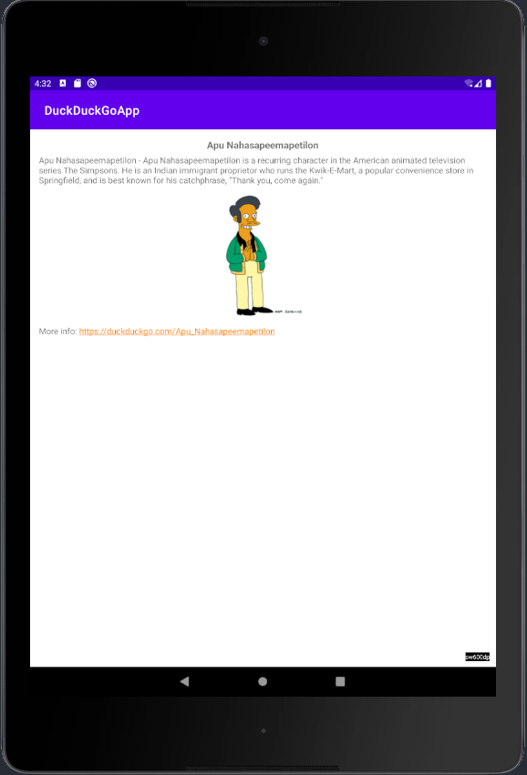

# DuckDuckGoApp - Characters

This application pulls Characters from https://api.duckduckgo.com and displays them as a list. Then you can click on an element in the list to see the details of the Character.   The application will render based on qualifiers (screen sizes) for Phones and Tablets based on the orientation.  
It also has two flavors (four variants).

## Packages and Libraries implemented

Hilt (Dagger2) for DI  
Glide for image rendering  
Retrofit for networking  
GSON for json parsing  
Lifecycle  
Kotlinx

## Design Patterns

MVVM  
Repository

## Application Captures

